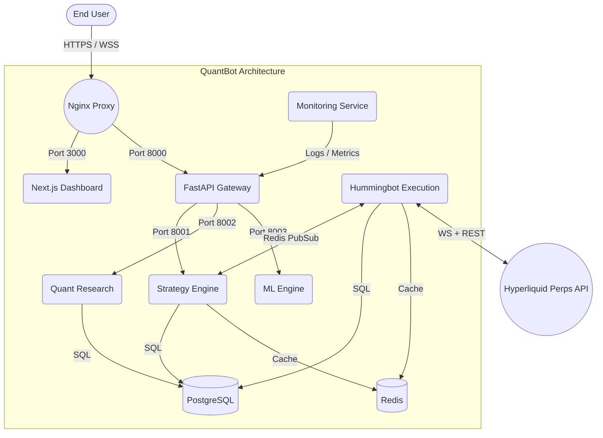

# Architecture Overview

## Docker Network (`quantbot-net`)
10 microservices operating over a secure internal bridge network.

## Data Lifecycle Flow
1. **Hyperliquid Connector** inside Hummingbot pushes `l2Book` and `trades` stream directly to **Redis Pub/Sub** (`market:ticks`).
2. **Strategy Coordinator** decodes ticks concurrently against mapped rule sets (EMA Trend/Fibonacci).
3. Derived raw signals run through the **Institutional Risk Engine**.
4. Risk Engine dynamically calculates position size based on existing portfolio equity and validates limits (Daily Drawdown).
5. Approved Signals are pushed to `signals:execute` back to Hummingbot.
6. Execution response logged symmetrically into PostgreSQL `orders` and `trades_history` tables.
